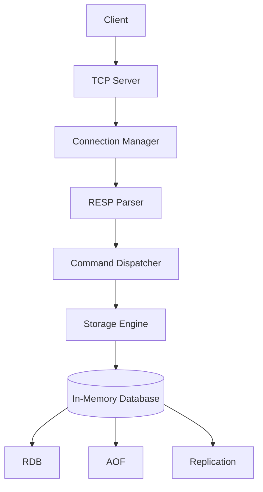
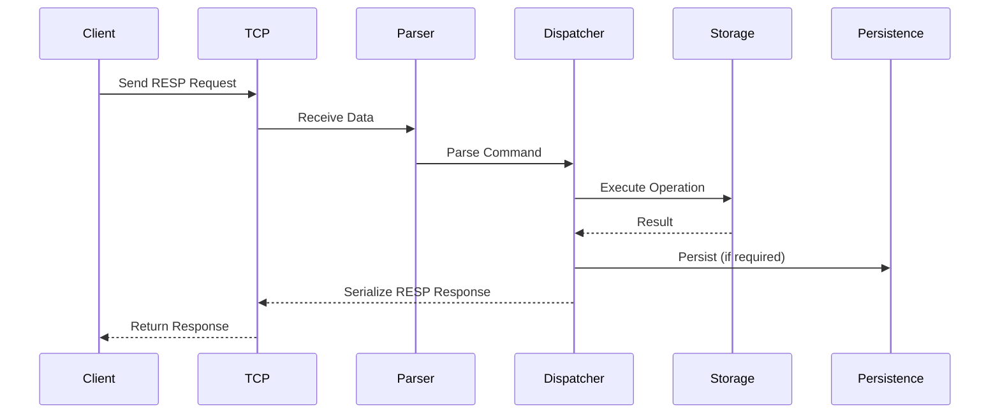

<div align="center">

<!-- Replace with your project banner -->


<br>

# Redis-Inspired Distributed In-Memory Database

### *A Production-Style Redis-Inspired In-Memory Database Built in Modern C++17*

<p align="center">
  <strong>
    Rebuilding the architectural concepts behind Redis—from the networking layer to persistence,
    replication, transactions, Pub/Sub, and native data structures—to understand how modern
    high-performance in-memory databases are engineered.
  </strong>
</p>

<br>

<p align="center">


</p>

</div>

---

# Overview

Redis-Inspired Distributed In-Memory Database is a systems programming project developed in **Modern C++17** to explore the internal architecture of modern in-memory databases.

Instead of simply recreating Redis commands, this project focuses on rebuilding the core engineering principles that make Redis one of the fastest and most widely used databases. It implements an event-driven server, the Redis Serialization Protocol (RESP), modular command execution, multiple native data structures, persistence mechanisms, replication, transactions, and Pub/Sub communication through a clean, layered architecture.

The objective is to understand **how an in-memory database actually works internally**—from accepting a TCP connection to parsing requests, executing commands, managing memory, persisting data, and synchronizing replicas.

---

# Why This Project?

Redis is often introduced as a fast key-value store, but its real strength lies in the engineering decisions behind it.

This project was built to explore those decisions by implementing the fundamental building blocks of a production-style database server rather than treating Redis as a black-box dependency.

The implementation emphasizes:

* Systems Programming
* Database Internals
* Network Programming
* Memory Management
* Protocol Design
* Modular Software Architecture
* Performance-Oriented Engineering

Rather than focusing solely on feature parity, the project prioritizes understanding the design patterns and architectural principles that power modern in-memory databases.

---

# Key Features

<table>

<tr>

<td width="50%" valign="top">

### 🌐 Networking

* TCP Socket Server
* Concurrent Client Connections
* Event-Driven Architecture
* Connection Management
* Graceful Shutdown

</td>

<td width="50%" valign="top">

### 📡 Protocol

* RESP Parser
* RESP Serializer
* Redis Client Compatibility
* Protocol Validation
* Structured Error Responses

</td>

</tr>

<tr>

<td valign="top">

### 🗄 Storage Engine

* In-Memory Key-Value Database
* Multiple Logical Databases
* Redis Object Model
* TTL Support
* Automatic Key Expiration

</td>

<td valign="top">

### ⚡ Command Framework

* Dynamic Command Registration
* Command Dispatcher
* Argument Validation
* Type Validation
* Extensible Architecture

</td>

</tr>

<tr>

<td valign="top">

### 💾 Persistence

* RDB Snapshotting
* Append Only File (AOF)
* Background Saving
* Automatic Recovery

</td>

<td valign="top">

### 🔄 Replication

* Master–Replica Architecture
* Synchronization
* Replica Management
* Replication Commands

</td>

</tr>

<tr>

<td valign="top">

### 📢 Communication

* Publish / Subscribe
* Channel Management
* Subscriber Tracking

</td>

<td valign="top">

### 🧪 Testing

* GoogleTest
* Storage Tests
* Protocol Tests
* Persistence Tests
* Command Tests

</td>

</tr>

</table>

---

# Architecture Overview

The server follows a layered architecture where every subsystem has a clearly defined responsibility.



This separation of concerns allows networking, protocol handling, storage, persistence, and replication to evolve independently without tightly coupling the implementation.

---

# Technology Stack

| Category            | Technology                          |
| ------------------- | ----------------------------------- |
| **Language**        | Modern C++17                        |
| **Build System**    | CMake                               |
| **Networking**      | TCP Sockets                         |
| **Protocol**        | Redis Serialization Protocol (RESP) |
| **Persistence**     | RDB & AOF                           |
| **Testing**         | GoogleTest                          |
| **Platform**        | Windows                             |
| **Version Control** | Git                                 |

---

# Design Principles

The architecture is guided by four fundamental principles.

### Modular Design

Each subsystem is implemented independently with well-defined interfaces, reducing coupling and simplifying future development.

### Extensibility

New commands and functionality can be introduced without major architectural modifications through the command registration framework.

### Maintainability

Networking, storage, persistence, protocol handling, and replication remain isolated from one another, making debugging and testing significantly easier.

### Performance

The request pipeline minimizes unnecessary overhead while remaining easy to understand and extend.

---

# Repository Structure

```text
Redis-Inspired-Distributed-In-Memory-Database
│
├── src/
│   ├── commands/
│   ├── networking/
│   ├── protocol/
│   ├── server/
│   └── storage/
│
├── tests/
│
├── docs/
│   └── Architecture.md
│
├── CMakeLists.txt
└── README.md
```

| Directory       | Description                                                                |
| --------------- | -------------------------------------------------------------------------- |
| **commands/**   | Redis-inspired command implementations and registration framework.         |
| **networking/** | TCP server, connection handling, and networking infrastructure.            |
| **protocol/**   | RESP parsing and response serialization.                                   |
| **server/**     | Server initialization, orchestration, replication, and runtime management. |
| **storage/**    | In-memory database, Redis object model, persistence, and data structures.  |
| **tests/**      | Unit tests covering storage, commands, protocol, and persistence.          |
| **docs/**       | Additional technical documentation and architecture notes.                 |

---

# 🚀 Getting Started

## Prerequisites

Before building the project, ensure the following tools are installed:

* **C++17** compatible compiler
* **CMake 3.16+**
* **Git**
* **GoogleTest** (for running the test suite)

> **Platform Support**
>
> The project is currently developed and tested on **Windows**. While the architecture is designed to be portable, additional platform-specific changes may be required for Linux or macOS.

---

# 📥 Installation

Clone the repository:

```bash
git clone https://github.com/Daksh-Tomar/Redis-Inspired-Distributed-In-Memory-Database.git

cd Redis-Inspired-Distributed-In-Memory-Database
```

---

# 🔨 Build

Create a build directory and compile the project using CMake.

```bash
mkdir build

cd build

cmake ..

cmake --build . --config Release
```

After a successful build, the executable will be generated inside the build directory.

---

# ▶️ Running the Server

Start the database server:

```bash
./RedisServer
```

Once the server starts, it begins listening for incoming client connections and processes requests using the RESP protocol.

---

# ⚙️ Request Lifecycle

Every client request follows a predictable execution pipeline.



Each subsystem is responsible for a single stage of processing, making the request pipeline modular, maintainable, and easy to extend.

---

# 🧠 Core Components

| Component              | Responsibility                                                                                   |
| ---------------------- | ------------------------------------------------------------------------------------------------ |
| **TCP Server**         | Accepts and manages incoming client connections.                                                 |
| **Connection Manager** | Tracks connected clients and manages client state.                                               |
| **RESP Parser**        | Parses incoming requests and serializes responses according to the Redis Serialization Protocol. |
| **Command Dispatcher** | Validates commands and routes them to their respective implementations.                          |
| **Storage Engine**     | Implements the in-memory database and Redis-inspired object model.                               |
| **Persistence Engine** | Handles RDB snapshots and Append Only File (AOF) persistence.                                    |
| **Replication Engine** | Synchronizes state between master and replica instances.                                         |

---

# 📦 Supported Capabilities

The database currently supports a rich subset of Redis-inspired functionality.

### Data Structures

* ✅ Strings
* ✅ Lists
* ✅ Hashes
* ✅ Sets
* ✅ Sorted Sets

---

### Server Features

* ✅ Multiple Logical Databases
* ✅ Key Expiration (TTL)
* ✅ Automatic Expiry Handling
* ✅ Publish / Subscribe
* ✅ Transactions
* ✅ Persistence
* ✅ Replication

---

### Persistence

* ✅ RDB Snapshotting
* ✅ Append Only File (AOF)
* ✅ Startup Recovery
* ✅ Background Saving

---

### Replication

* ✅ Master–Replica Synchronization
* ✅ Replica State Management
* ✅ Replication Commands

---

# 📊 Performance

To evaluate throughput, the server was benchmarked using a workload of:

* **100,000 Requests**
* **50 Concurrent Clients**
* **Single-Threaded Server**

The benchmark demonstrates consistent performance across both read and write workloads.

| Operation |         Throughput |
| --------- | -----------------: |
| **PING**  | **~16.2k req/sec** |
| **GET**   | **~13.9k req/sec** |
| **LPOP**  | **~11.2k req/sec** |
| **SADD**  | **~10.7k req/sec** |
| **INCR**  | **~10.4k req/sec** |
| **LPUSH** |  **~9.9k req/sec** |
| **SET**   |  **~9.7k req/sec** |

> These results were collected using the project's benchmark suite and are intended to provide a general indication of system performance under concurrent workloads.

---

# 🧪 Testing

The project includes a comprehensive GoogleTest-based test suite covering multiple subsystems.

### Covered Areas

* Command Execution
* Storage Engine
* RESP Parser
* Persistence
* Data Structures
* Server Components

Run the tests using:

```bash
ctest
```

or

```bash
cmake --build . --target test
```

depending on your build configuration.

---

# 🎯 Project Objectives

The primary goal of this project is to understand the engineering principles behind modern in-memory databases by implementing their core components from scratch.

This includes:

* Event-driven networking
* Redis protocol implementation
* Modular command execution
* Native data structures
* Persistence mechanisms
* Replication architecture
* Transaction processing
* Clean software architecture
* Systems programming practices

---

# 🛣️ Roadmap

The project continues to evolve as additional database capabilities are explored.

## Completed

* [x] Event-Driven TCP Server
* [x] Redis Serialization Protocol (RESP)
* [x] Dynamic Command Framework
* [x] Native Redis-Inspired Data Structures
* [x] Multiple Logical Databases
* [x] TTL & Key Expiration
* [x] RDB Snapshot Persistence
* [x] Append Only File (AOF)
* [x] Master–Replica Replication
* [x] Publish / Subscribe
* [x] Transaction Support
* [x] Unit Testing with GoogleTest

---

## Planned Improvements

Future development will focus on expanding the database while preserving the existing modular architecture.

* [ ] Cross-platform support (Linux & macOS)
* [ ] Client authentication & ACL
* [ ] Lua scripting support
* [ ] Redis Streams
* [ ] Cluster mode
* [ ] Performance profiling
* [ ] Improved benchmark suite
* [ ] Monitoring & metrics
* [ ] Configuration hot-reloading

---

# 🤝 Contributing

Contributions are welcome.

If you'd like to improve the project, please:

1. Fork the repository.
2. Create a feature branch.
3. Commit your changes with meaningful commit messages.
4. Ensure the project builds successfully.
5. Submit a Pull Request with a clear description of your changes.

If you're planning a significant architectural change, consider opening an issue first so the design can be discussed before implementation.

---

# 📈 Future Vision

This project began as an exploration of Redis internals but has grown into a modular database server capable of demonstrating many of the architectural concepts used in modern in-memory databases.

Future work will continue to focus on:

* Better scalability
* Additional Redis-compatible features
* Stronger testing and benchmarking
* Improved observability
* Cleaner abstractions
* Cross-platform compatibility

The long-term objective is to create a well-structured educational codebase that showcases modern systems programming techniques while remaining approachable for developers interested in database internals.

---

# 📚 References

This project was inspired by the design and architecture of several well-known open-source systems.

* Redis
* Modern C++ (ISO C++17)
* CMake
* GoogleTest

These projects served as references for architectural concepts and development practices while the implementation itself was developed independently for educational purposes.

---

# 📄 License

This project is licensed under the **MIT License**.

See the `LICENSE` file for more information.

---

# ⭐ If You Found This Project Interesting

If you found this repository useful or learned something from it, consider giving it a ⭐ on GitHub. It helps others discover the project and motivates continued development.

---

<div align="center">

## Thank You for Visiting!

**Redis-Inspired Distributed In-Memory Database**

*A production-style systems programming project exploring the architecture of modern in-memory databases through a modular C++17 implementation.*

<br>

Made with ❤️ using **Modern C++17**

</div>
